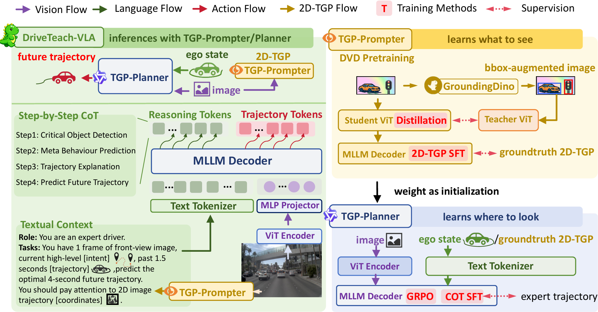

# DriveTeach-VLA

**Teaching Vision-Language-Action Models What to See and Where to Look**

[](https://arxiv.org/abs/2607.01658) [](https://arxiv.org/abs/2607.01658) [](https://github.com/ShivaTeam/DriveTeach-VLA/blob/master/LICENSE)

🎉 [2026.06.24] Our paper has been accepted by ECCV 2026.

> DriveTeach-VLA explicitly teaches VLAs *what to see* and *where to look*.
> Driving-aware Vision Distillation (DVD) injects traffic-specific priors into the vision encoder, while 2D Trajectory-Guided Prompts (2D-TGP) provide spatial grounding aligned with feasible driving paths.

## Overview



Existing Vision-Language-Action (VLA) models for autonomous driving rely heavily on text-centric VQA and Chain-of-Thought pretraining, which emphasizes linguistic reasoning but lacks spatial grounding crucial for reliable trajectory prediction.

DriveTeach-VLA introduces a vision-guided learning pipeline:

- **What to see** — DVD pretraining transfers traffic visual cues via self-distillation from bbox-augmented images
- **Where to look** — TGP-guided SFT provides spatial grounding aligned with feasible driving trajectories
- **How to act** — TGP-guided GRPO further aligns trajectory prediction with better driving preferences


DriveTeach-VLA uses a dual-model inference pass: the TGP-Prompter first predicts 2D-TGP from the front-view image, then the TGP-Planner generates the BEV trajectory conditioned on the predicted 2D-TGP.

## TODO

- [x] Configurable Data Engine
- [x] Driving-aware Vision Distillation (DVD) code
- [x] LLaMA-Factory SFT configuration
- [x] Reinforcement Learning code — available at [Curious-VLA](https://github.com/Mashiroln/curious_vla)
- [ ] Release Annotations and Datasets

## Data Engine

The `data_engine/` directory contains a configurable pipeline for constructing training datasets:

- **Extract** — Navsim v2.0.0 raw data → structured intermediate representation (SampleIR)
- **Enrich** — Pluggable enricher chain: path substitution,  trajectory normalization, camera projection (2D-TGP), pseudo-label merging
- **Render** — Python PromptBuilders (registered via `@register_prompt`) produce LLaMA-Factory-compatible training data

Three built-in pipelines:

| Pipeline | Purpose | PromptBuilder |
|----------|---------|---------------|
| `poutine_label` | VLM pseudo-labeling input | Expert trajectory + image → `{critical_objects, meta_behaviour, explanation}` |
| `prompter` | DVD pretraining (2D-TGP) | Front-view + past trajectory → `[PT, {"point_2d":..., "heading":...}, ...]` |
| `planner` | CoT-SFT training | Front-view + 2D-TGP keypoints → CoT JSON with normalized trajectory |

```bash
python data_engine/main.py --config data_engine/configs/pipelines/planner.yaml
```

See the full [data engine documentation](https://github.com/ShivaTeam/DriveTeach-VLA/blob/master/data_engine/README.md).

## Training

The `dvd/` and `sft/` directory contains the DVD pretraining and SFT fine-tuning pipeline for LLaMA-Factory. The patched LLaMA-Factory supports custom DVD parameters in training YAMLs:
- enable_dvd
- dvd_h_size
- dvd_w_size
- dvd_tgp_weight
- dvd_ema

See the full [DVD documentation](https://github.com/ShivaTeam/DriveTeach-VLA/blob/master/dvd/README.md).

## Citation

```bibtex
@misc{yang2026teaching,
  title={Teaching Vision-Language-Action Models What to See and Where to Look},
  author={Yuguang Yang and Canyu Chen and Zhewen Tan and Yizhi Wang and Zichao Feng and Chunyang Liu and Kehua Sheng and Juan Zhang and Linlin Yang and Baochang Zhang and Yan Wang and Bo Zhang and Xianbin Cao},
  year={2026},
  eprint={2607.01658},
  archivePrefix={arXiv},
  primaryClass={cs.CV},
  url={https://arxiv.org/abs/2607.01658},
}
```

## Acknowledgements

This project is built upon [Qwen2.5-VL](https://github.com/QwenLM/Qwen2.5-VL), [NAVSIM](https://github.com/autonomousvision/navsim), [Transformers](https://github.com/huggingface/transformers), and [LLaMA-Factory](https://github.com/hiyouga/LlamaFactory).

Prompt design is inspired by [ReCogDrive](https://github.com/xiaomi-research/ReCogDrive) and [Poutine](https://arxiv.org/abs/2506.11234).

Reinforcement learning design comes from [Curious-VLA](https://github.com/Mashiroln/curious_vla).

We thank the open-source community for their contributions.

## License

This project is licensed under the [Apache 2.0 License](https://github.com/ShivaTeam/DriveTeach-VLA/blob/master/LICENSE).
